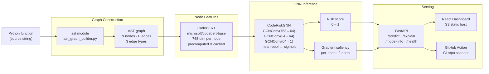

<div align="center">

# Graphault

**Graph Neural Network vulnerability detection for Python functions**

*Graphs the function, not the repository — structural risk scoring without pattern matching.*

[](https://www.python.org/)
[](https://pyg.org/)
[](https://fastapi.tiangolo.com/)
[](https://vitejs.dev/)
[](https://aws.amazon.com/)
[](https://www.docker.com/)
[](LICENSE)

**[Live API](http://43.205.146.154)** · **[Swagger UI](http://43.205.146.154/docs)** · **[Dashboard](http://graphault-frontend.s3-website.ap-south-1.amazonaws.com)**

</div>

---

<div align="center">


*Single-function risk scoring with gradient-saliency AST node highlighting*

</div>

---

## Overview

Most static analysis tools match known vulnerability patterns against source code. Graphault takes a different approach: it converts each Python function into a graph — one node per AST element, three edge types encoding parent/child structure and sequential control flow — and trains a Graph Convolutional Network to classify risk directly from that topology.

Node features are 768-dimensional CodeBERT embeddings computed from each node's code token, giving the model both structural and semantic signal. Inference runs per-function, in under 50 ms, against a REST API that also returns gradient-based saliency scores indicating which AST nodes most influenced the prediction.

The approach is aligned with [Devign (Zhou et al., 2019)](https://arxiv.org/abs/1909.03496) and [ReVeal (Chakraborty et al., 2021)](https://arxiv.org/abs/2009.07235): per-function Code Property Graph classification trained on real CVE-linked commits.

---

## Key Features

| Feature | Description |
|---|---|
| **Per-function scoring** | POST any Python function; receive a risk score (0–1) and binary label in one API call |
| **Gradient saliency** | `/explain` returns per-node contribution scores via input-gradient L2 norm — no extra dependencies |
| **Repo-wide scan** | GitHub Action and CLI scan every function in a repository, outputting ranked risk across the codebase |
| **GitHub Action CI** | Drop `.github/workflows/graphault.yml` into any Python repo for automated PR-level vulnerability scanning |
| **AWS deployment** | API on EC2 (t3.micro, ap-south-1) behind nginx with rate limiting; frontend on S3 static hosting |

---

## How It Works

### The core insight

Vulnerability detectors fail when they rely on signatures — an attacker names the function differently and evades the check. Graphault reasons over *structure*: the shape of the AST subgraph that implements a `Call` node chained into a `BinOp` inside an `Assign` is characteristic of string-concatenated SQL regardless of what the variables are named.

### Pipeline



### Edge types

| Type | Direction | Meaning |
|---|---|---|
| `0` | parent → child | AST structural descent |
| `1` | child → parent | AST structural ascent (bidirectional message passing) |
| `2` | stmt → next stmt | Sequential control flow |

### Saliency

`/explain` runs a forward pass with `requires_grad=True` on the input node feature matrix, computes the scalar output score, calls `.backward()`, and returns `‖∂score/∂xᵢ‖₂` normalised to [0, 1] for the top-10 nodes. No external explainability library is required; the API contract is stable across model upgrades.

---

## Data Integrity

Vulnerability datasets sourced from real CVE-linked commits suffer from two systematic problems: near-duplicate functions (copied across projects and forks) that inflate test-set performance, and mislabelled adjacent functions (a CVE commit touches multiple functions; only one is actually vulnerable). Both are addressed before any split is made.

| Stage | Functions | Notes |
|---|---|---|
| Raw collection | 156,774 | CVEfixes, BugsinPy, GitHub OSS clean samples |
| After AST normalisation | — | Whitespace, comments, docstring stripped; canonical token form |
| After MinHash/LSH dedup | **81,140** | ~40% near-duplicates removed across project forks |
| Train split | 64,911 | 80% of unique function *names* |
| Test split | 16,229 | 20% of unique function names — zero name overlap with train |
| Positive rate (test) | 7.63% | 1,224 vulnerable / 16,229 total |
| pos_weight in loss | 12.10 | Balances BCEWithLogitsLoss for the 12:1 imbalance |

The train/test split is by **unique function name**, not by sample index. A function named `parse_xml` can appear in only one of the two splits — preventing the most common form of leakage in vulnerability datasets.

---

## Metrics

Evaluated on the held-out test split (16,229 functions, 1,224 positive). PR-AUC is the primary metric because accuracy is uninformative at 12:1 imbalance.

| Model | PR-AUC | Uplift vs. Random | F1 (opt. threshold) | Precision | Recall |
|---|---|---|---|---|---|
| Random baseline | 0.0763 | 1.00× | — | — | — |
| 89-dim AST one-hot GNN | 0.2042 | 2.68× | — | — | — |
| **CodeBERT 768-dim GNN** | **0.2318** | **3.04×** | **0.282** | **0.228** | **0.370** |

*CodeBERT model: best checkpoint at epoch 48 of 50. Optimal threshold: 0.683. At threshold 0.5: F1 0.247, precision 0.152, recall 0.658.*

**On the numbers:** A PR-AUC of 0.23 sounds low — it is, and it's intentional to say so. The task is hard: shallow GNN mean-pooling, 12:1 imbalance, and label noise from multi-function CVE commits all suppress precision. The 3.04× uplift over a random classifier is reproducible and real. CodeBERT node features (+0.028 PR-AUC, +13.5% relative over the one-hot baseline) confirm that token semantics add signal beyond pure graph structure. The roadmap items below are the concrete next steps to close the gap with SOTA detectors.

<div align="center">


*Repository scan output — all functions ranked by risk score*

</div>

---

## Architecture & Stack

```
Browser / S3 Frontend (React + Vite)
         │  HTTP
         ▼
EC2 t3.micro  ap-south-1
  nginx  :80 → 127.0.0.1:8000   (rate limit: 10 req/min per IP)
         │
  Docker: graphault-api
    FastAPI + uvicorn
      POST /predict    →  risk score + label
      POST /explain    →  score + top-10 saliency nodes
      GET  /model-info →  architecture, metrics, threshold
      GET  /health     →  {"status":"ok","model_loaded":true}
    CodeRiskGNN loaded once at startup (CPU inference)
         │
    MongoDB Atlas  (training data only — not on inference path)
         labeled_functions: CVEfixes · BugsinPy · GitHub OSS
```

| Layer | Technology |
|---|---|
| GNN model | PyTorch 2.12, PyTorch Geometric 2.7, GCNConv (3-layer) |
| Node features | `microsoft/codebert-base` via HuggingFace Transformers |
| Graph construction | Python `ast` module, custom CPG-style edge types |
| Training data | MongoDB Atlas — CVEfixes, BugsinPy, GitHub OSS |
| Deduplication | MinHash + LSH (`datasketch`) |
| API | FastAPI, uvicorn, Pydantic v2 |
| Frontend | React 18, Vite 5 |
| Containerisation | Docker, docker-compose |
| Reverse proxy | nginx (rate limiting, loopback binding) |
| Deployment | AWS EC2 t3.micro (API), AWS S3 static (frontend) |
| Security | fail2ban, key-pair SSH, `PasswordAuthentication no` |

---

## API Reference

Base URL: `http://43.205.146.154` — interactive Swagger UI at `/docs`

### `POST /predict`

```bash
curl -X POST http://43.205.146.154/predict \
  -H "Content-Type: application/json" \
  -d '{"code": "def get_user(name):\n    query = \"SELECT * FROM users WHERE name = \" + name\n    return db.execute(query)"}'
```

```json
{
  "risk_score": 0.7341,
  "label": 1,
  "num_nodes": 20
}
```

### `POST /explain`

Same request body. Returns the score plus per-node gradient saliency:

```json
{
  "risk_score": 0.7341,
  "label": 1,
  "top_nodes": [
    { "node_index": 8, "node_type": "BinOp",  "lineno": 2, "contribution": 1.00 },
    { "node_index": 3, "node_type": "Assign", "lineno": 2, "contribution": 0.84 },
    { "node_index": 6, "node_type": "arg",    "lineno": 1, "contribution": 0.62 }
  ]
}
```

### `GET /model-info`

Returns model architecture metadata, evaluation metrics, threshold, and dataset description.

<div align="center">


*Gradient saliency mapped back to source code — red nodes drove the risk score*

</div>

---

## Quickstart

**Prerequisites:** Python 3.11+, Node 18+, Docker (optional for containerised API)

### 1. Clone and install

```bash
git clone https://github.com/jayeshmehra344/codesense.git
cd codesense
python -m venv venv
source venv/bin/activate          # Windows: venv\Scripts\activate
pip install torch==2.12.0 --index-url https://download.pytorch.org/whl/cpu
pip install -r requirements-api.txt
```

### 2. Environment

```bash
# .env in the project root:
MONGO_URI=mongodb+srv://<user>:<password>@<cluster>.mongodb.net/codesense
MONGO_DB_NAME=codesense
GITHUB_TOKEN=<your_pat>           # only needed for data ingestion
```

### 3. Run the API

```bash
uvicorn src.api.app:app --reload --port 8000
# Swagger UI: http://localhost:8000/docs
```

### 4. Run the frontend

```bash
cd src/frontend
npm install
npm run dev
# Dashboard: http://localhost:5173
```

### 5. Train (requires MongoDB with labeled data)

```bash
# 89-dim one-hot baseline
python src/model/train.py

# CodeBERT 768-dim (requires precomputed embeddings cache)
python src/model/train.py codebert

# Recompute CodeBERT node embeddings (one-time, ~2 hr on GPU)
python src/model/precompute_codebert.py
```

### 6. Docker

```bash
docker build -t graphault-api .
docker run -p 127.0.0.1:8000:8000 --env-file .env graphault-api
```

---

## Project Structure

```
codesense/
├── src/
│   ├── api/
│   │   └── app.py                    # FastAPI service — /predict, /explain, /model-info
│   ├── model/
│   │   ├── gnn.py                    # CodeRiskGNN — 3-layer GCNConv
│   │   ├── train.py                  # Training loop (one-hot baseline + CodeBERT paths)
│   │   ├── precompute_codebert.py    # One-time CodeBERT node embedding computation
│   │   ├── dataset.py                # PyG Dataset wrapper
│   │   └── find_threshold.py         # PR curve + F1-optimal threshold search
│   ├── parser/
│   │   └── ast_graph_builder.py      # Python source → PyG Data (nodes, edges, features)
│   ├── graph/
│   │   ├── db.py                     # MongoDB connection helper
│   │   ├── labeler.py                # CVE label assignment from commit metadata
│   │   └── pipeline.py               # End-to-end ingestion orchestration
│   ├── data/
│   │   ├── cvefixes_loader.py        # CVEfixes dataset ingestion
│   │   ├── bugsinpy_loader.py        # BugsinPy dataset ingestion
│   │   ├── github_loader.py          # GitHub OSS clean-function sampling
│   │   └── dedup.py                  # MinHash/LSH deduplication pipeline
│   ├── scan/
│   │   └── repo_scan.py              # Repository-wide per-function risk scanner
│   └── frontend/
│       └── src/
│           ├── App.jsx               # Single-function predict + explain dashboard
│           └── RepoScan.jsx          # Repo scan UI
├── data/
│   ├── splits/
│   │   ├── train_ids.json            # 64,911 deduplicated training function IDs
│   │   └── test_ids.json             # 16,229 held-out test function IDs
│   ├── model.pt                      # Weights — 89-dim one-hot GNN baseline
│   ├── model_deduped_89dim.pt        # Weights — 89-dim on deduplicated split
│   └── model_deduped_codebert.pt     # Weights — CodeBERT 768-dim (production)
├── docs/                             # Screenshots (fill with real captures)
│   ├── dashboard.png
│   ├── repo-scan.png
│   └── explain.png
├── .github/
│   └── workflows/
│       └── graphault.yml             # PR-analysis GitHub Action
├── Dockerfile
├── docker-compose.yml
└── requirements-api.txt
```

---

## Limitations

- **Baseline-quality detection.** PR-AUC of 0.23 represents a working research prototype, not a production security scanner. False-positive rate at practical recall thresholds is high.
- **Function-level only.** Inter-procedural vulnerabilities (e.g. taint that crosses function boundaries) are outside the current model's scope.
- **Saliency is diagnostic, not validated localisation.** Gradient attribution highlights nodes that drove the score; it has not been validated against ground-truth vulnerable line annotations.
- **Static analysis.** Runtime behaviour, environment variables, and dynamic dispatch are invisible to the AST representation.
- **Python only.** The parser is built on Python's `ast` module; other languages require tree-sitter integration.
- **Label noise.** CVE-linked commits often modify multiple functions; non-vulnerable adjacent functions may carry positive labels in the training data.

---

## Roadmap

**Model quality**
- [ ] Multi-edge CPG with explicit data-flow (def→use) and control-flow edges + relational GNN (RGCN) treating each edge type separately
- [ ] Attention-based pooling (Graph Attention Networks / GIN) instead of mean pooling — attends to the highest-risk subgraph rather than averaging across all nodes
- [ ] Regularisation: dropout tuning, label smoothing, mixup on graph embeddings to reduce the train/test PR-AUC gap (~0.045 at epoch 50)
- [ ] GraphCodeBERT (code-structure-aware pretraining) as a drop-in replacement for vanilla CodeBERT node features
- [ ] Focal loss to further address the 12:1 class imbalance
- [ ] Ensemble: majority-vote across one-hot GNN + CodeBERT GNN + tree-kernel SVM for improved precision

**Data**
- [ ] Scale to 500k+ functions with broader CVE coverage (OSV, NVD, GHSA)
- [ ] Human-in-the-loop annotation: flagged predictions → manual review → retrain pipeline
- [ ] Multi-language via tree-sitter (JavaScript, TypeScript, C/C++, Go)

**Infrastructure**
- [ ] GitHub-URL scanning: accept a repo URL, clone, scan all Python functions, return ranked report
- [ ] HTTPS via Let's Encrypt / ACM
- [ ] CI/CD: GitHub Action → rebuild and push Docker image on merge to `master`
- [ ] Structured logging + CloudWatch metrics for latency and error rate

---

## Citation / Inspiration

```
@article{zhou2019devign,
  title   = {Devign: Effective Vulnerability Identification by Learning Comprehensive Program Semantics via Graph Neural Networks},
  author  = {Zhou, Yaqin and others},
  journal = {NeurIPS},
  year    = {2019}
}

@article{chakraborty2021reveal,
  title   = {Deep Learning based Vulnerability Detection: Are We There Yet?},
  author  = {Chakraborty, Saikat and others},
  journal = {IEEE TSE},
  year    = {2021}
}
```

---

<div align="center">

Built by [jayeshmehra344](https://github.com/jayeshmehra344) &nbsp;·&nbsp; Python · PyTorch Geometric · FastAPI · React · AWS

</div>
